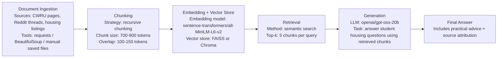

# Project 1 Planning: The Unofficial Guide

## Domain
Off-campus housing around Case Western Reserve University in Cleveland, OH for undergraduate and graduate students.

This domain is valuable because many CWRU students eventually need to find housing beyond university-managed dorms, especially upperclassmen, graduate students, international students, and students staying in Cleveland over the summer. While official university resources may list general housing options or safety guidance, they often do not capture the practical details students actually care about, such as which apartments are affordable, which neighborhoods feel safe at night, and how reliable public transportation is. This knowledge is often spread through word of mouth, Reddit posts, group chats, Facebook groups, and advice from older students, making it useful but difficult to find in one trustworthy place.

---

## Documents

<!-- List your specific sources: URLs, subreddit names, forum threads, or file descriptions.
     Aim for at least 10 sources that together cover different subtopics or perspectives within your domain. -->

| # | Source | Description | URL or location |
|---|--------|-------------|-----------------|
| 1 | CWRU Off-Campus Housing: 12 Questions to Ask Before Renting An Apartment | Official off-campus housing article with practical questions students should ask before signing a lease, including rent, utilities, maintenance, safety, and landlord expectations. | https://offcampus.case.edu/resources/article/2175-12-questions-to-ask-before-renting-an-apartment |
| 2 | CWRU Off-Campus Housing: Eligibility to Live Off-Campus | Official guidance on which students are eligible to live off campus and what restrictions or requirements may apply. | https://offcampus.case.edu/resources/article/1293-eligibility-to-live-off-campus |
| 3 | CWRU Off-Campus Housing: Starting Your Search | Official guide for beginning the off-campus housing search, including how early to look, what to compare, and how to organize options. | https://offcampus.case.edu/resources/article/1271-starting-your-search |
| 4 | CWRU Off-Campus Housing: First Apartment Challenge | Official student-focused guide about what students need to know when renting their first apartment, including budgeting, responsibilities, and common mistakes. | https://offcampus.case.edu/resources/article/2645-first-apartment-challenge-what-you-really-need-to-know |
| 5 | CWRU Off-Campus Housing: How to Avoid Scams | Official housing safety resource about identifying rental scams, suspicious listings, and unsafe payment requests. | https://offcampus.case.edu/resources/article/1997-how-to-avoid-scams |
| 6 | CWRU Off-Campus Housing: Suggested Questions for Landlords | Image-based checklist of questions students should ask landlords before renting, such as lease terms, utilities, maintenance, parking, and safety. | https://offcampus.case.edu/resources/article/1268-suggested-questions-for-landlords |
| 7 | CWRU Off-Campus Housing: 5 Tips For Moving into Your First Apartment | Official article with practical advice for students moving into their first apartment, including preparation, supplies, and move-in expectations. | https://offcampus.case.edu/resources/article/1289-5-tips-for-moving-into-your-first-apartment |
| 8 | CWRU Off-Campus Housing: Roommates - Things to Consider | Official roommate guidance covering roommate expectations, communication, shared responsibilities, and potential conflicts. | https://offcampus.case.edu/resources/article/1270-roommates-things-to-consider |
| 9 | CWRU Off-Campus Housing: Parking & Transportation | Official off-campus housing article about transportation and parking considerations for students living away from campus. | https://offcampus.case.edu/resources/article/1275-parking-transportation |
| 10 | CWRU Transportation | Official transportation page covering shuttles, public transit, campus maps, and ways to get around University Circle. | https://case.edu/parking/transportation |
| 11 | CWRU Graduate Student Life: Getting Around | Graduate student resource explaining parking, shuttles, Safe Ride, walking escorts, and public transit options. | https://case.edu/studentlife/graduate/resources/getting-around |
| 12 | Reddit r/cwru: Off Campus Housing for International Student | Student discussion about safe, close, and affordable housing for an incoming international graduate student. | https://www.reddit.com/r/cwru/comments/1bjmnxs/off_campus_housing_for_international_student/ |
| 13 | Reddit r/cwru: Off-Campus Housing | Student thread about when to sign leases, how competitive close-to-campus housing is, and what practical factors to consider. | https://www.reddit.com/r/cwru/comments/1hag67j/offcampus_housing/ |
| 14 | Reddit r/cwru: Bad Landlords? | Student discussion about landlord experiences, warnings, maintenance issues, and CWRU property management. | https://www.reddit.com/r/cwru/comments/1alnfo4/bad_landlords/ |
| 15 | Reddit r/cwru: Housing Within Walking Distance | Student thread asking for housing within walking distance of campus, with comments on Fairchild, Cleveland Clinic area apartments, and demand/waitlists. | https://www.reddit.com/r/cwru/comments/1dlzocf/housing/ |
| 18 | Reddit r/cwru: Off-Campus Housing for Older First-Year Students | Thread about exceptions to CWRU’s on-campus residency requirement and whether older first-years can live off campus. | https://www.reddit.com/r/cwru/comments/1jz1onu/offcampus_housing_older_first_year_students/ |

---

## Chunking Strategy

<!-- How will you split documents into chunks?
     State your chunk size (in tokens or characters), overlap size, and explain why those
     numbers fit the structure of your documents.
     A review-heavy corpus warrants different chunking than a long FAQ. -->

**Chunk size:**
700–900 tokens per chunk, using recursive chunking by headings, paragraphs, and then sentences when needed.

**Overlap:**
100–150 tokens of overlap between adjacent chunks.

**Reasoning:**
This fits my document set because the corpus includes a mix of official CWRU pages, which are longer and structured by headings, and Reddit/forum-style student discussions, which are shorter, opinion-based, and often contain useful details in comments. Recursive chunking is better than simple fixed-size chunking because it can preserve natural structure by splitting first by headings, then paragraphs, then sentences if needed. This matters because housing information is often contextual: a student might mention a neighborhood, price range, safety concern, commute, and landlord experience all in the same paragraph or thread.

For longer official pages, chunks around 700–900 tokens are large enough to keep related information together, such as transportation options, parking rules, or university housing policies. For Reddit threads, I would chunk by post and comment groups when possible, so short comments are not separated from the question they are responding to. The 100–150 token overlap helps when important details span two chunks, such as a student describing both an apartment name and the reason they recommend or avoid it.

If chunks are too small, retrieval might return isolated details without enough context. For example, a search for “safe housing near CWRU for international students” might retrieve only a comment saying “Little Italy is fine” without the explanation about distance, rent, or transportation. If chunks are too large, retrieval might return broad pages or long threads with too many mixed opinions, making it harder to identify the specific answer. Bad retrieval for this project would look like answers that mention housing options but fail to include the practical student concerns, such as affordability, landlord reputation, commute, lease timing, and safety.

---

## Retrieval Approach

<!-- Which embedding model are you using (e.g., all-MiniLM-L6-v2 via sentence-transformers)?
     How many chunks will you retrieve per query (top-k)?
     If you were deploying this for real users and cost wasn't a constraint, what tradeoffs
     would you weigh in choosing a different embedding model — context length, multilingual
     support, accuracy on domain-specific text, latency? -->

**Embedding model:** `all-MiniLM-L6-v2` via `sentence-transformers`

**Top-k:** Retrieve the top 5 chunks per query.

**Production tradeoff reflection:**

If this were deployed for real users and cost was not a constraint, I would consider using a stronger embedding model with better retrieval accuracy, longer context support, and stronger performance on informal student language. The system needs to retrieve enough chunks to give the LLM useful context, so I would likely start with top-k = 5 because it balances coverage and focus. If too few chunks are retrieved, the answer may miss important details, such as safety concerns, landlord issues, or transportation options. If too many chunks are retrieved, the LLM may receive noisy or conflicting information and produce a less focused answer.

I would also consider multilingual support because international students may ask housing questions in different languages or use informal phrasing. Semantic search is useful here because it can find relevant chunks based on meaning, even when the query does not use the exact same words as the document. For example, a student asking “Where can I live without a car?” could retrieve chunks about shuttles, walking distance, public transit, and Safe Ride, even if the document does not contain that exact phrase. Since this domain includes both official housing policies and opinion-heavy student reviews, I would prioritize a model that handles messy conversational text well while still retrieving precise facts like apartment names, lease timing, shuttle access, and safety concerns.

---

## Evaluation Plan

<!-- List your 5 test questions with their expected correct answers.
     Questions should be specific enough that you can judge whether the system's response
     is right or wrong. "What are good dining halls?" is too vague.
     "What do students say about wait times at [dining hall name] during lunch?" is testable. -->

| # | Question                                                                                                     | Expected answer                                                                                                                                                            |
| - | ------------------------------------------------------------------------------------------------------------ | -------------------------------------------------------------------------------------------------------------------------------------------------------------------------- |
| 1 | What official CWRU resource can students use to search for off-campus apartments and roommates?              | Students can use the CWRU Off-Campus Housing website, which includes rental listings, roommate search, and related housing resources.                                      |
| 2 | What neighborhoods or areas do students commonly mention for off-campus housing near CWRU?                   | Expected areas include University Circle, Little Italy, Cleveland Heights, Coventry, Hessler, and areas near the Cleveland Clinic.                                         |
| 3 | What practical factors should students consider before signing an off-campus lease near CWRU?                | Students should consider rent, distance to campus, safety, transportation, parking, landlord reputation, lease timing, roommate needs, and whether utilities are included. |
| 4 | What transportation options are relevant for students living off campus near CWRU?                           | Relevant options include walking, biking, CWRU shuttles, Safe Ride, public transit/RTA, parking permits, and campus transportation services.                               |
| 5 | What do student discussions suggest students should be cautious about when choosing landlords or apartments? | Students should look for landlord responsiveness, maintenance quality, lease clarity, hidden fees, safety issues, and negative reviews from other students before signing. |

---

## Anticipated Challenges

1. **Noisy or inconsistent documents**  
   Student sources like Reddit threads and comments may be subjective or contradictory. Different students may have opposite opinions about the same apartment, neighborhood, or landlord, so the system could accidentally present one person’s experience as a general fact.

2. **Off-topic or weak retrieval**  
   A query about “safe housing near campus” might retrieve general transportation pages or broad apartment listings instead of specific safety-related discussions. This could lead to answers that sound relevant but do not actually address the student’s concern.

3. **Key information split across chunks**  
   Important context may be divided between two chunks. For example, one chunk might mention an apartment name, while the next chunk explains the maintenance problems or landlord issues.

4. **Missing or unclear source attribution**  
   Housing advice can affect where students choose to live, so the system needs to clearly show where information comes from. It should distinguish between official CWRU information and student-reported experiences.

5. **Outdated housing information**  
   Rent prices, availability, landlord quality, and transportation routes can change over time. The system may retrieve information that was accurate when posted but is no longer reliable.

---

## Architecture

<!-- Draw a diagram of your pipeline showing the five stages:
     Document Ingestion → Chunking → Embedding + Vector Store → Retrieval → Generation
     Label each stage with the tool or library you're using.
     You can use ASCII art, a Mermaid diagram, or embed a sketch as an image.
     You'll use this diagram as context when prompting AI tools to implement each stage. -->

---

## AI Tool Plan

1. **Document Ingestion**  
   I plan to use ChatGPT or Claude to help write the document ingestion code. I will give it my **Documents** section, the list of source URLs, and the requirement that each document should be stored with metadata such as source title, URL, document type, and date accessed. I expect it to produce a Python function that can load saved text files or scraped webpage text into a consistent document format. I will verify the output by checking that each source is loaded correctly and that the metadata is preserved.

2. **Chunking**  
   I plan to use Claude or ChatGPT to implement the chunking function. I will give it my **Chunking Strategy** section, including the recursive chunking strategy, **700–900 token chunk size**, and **100–150 token overlap**. I expect it to produce a `chunk_text()` function that splits documents by headings, paragraphs, and sentences when possible. I will verify it by printing sample chunks and checking that they are not too short, too long, or cut off in the middle of important housing details.

3. **Embedding + Vector Store**  
   I plan to use ChatGPT or GitHub Copilot to help implement the embedding and vector database step. I will give it my **Retrieval Approach** section, especially the embedding model `sentence-transformers/all-MiniLM-L6-v2`, and ask it to generate code for embedding chunks and storing them in FAISS or Chroma. I expect it to produce working Python code that converts chunks into vectors and saves them for later search. I will verify this by checking that the number of embeddings matches the number of chunks and that a sample query returns relevant results.

4. **Retrieval**  
   I plan to use ChatGPT to help write the retrieval function. I will give it my **Retrieval Approach** section and specify that the system should retrieve **top-k = 5** chunks per query using semantic similarity. I expect it to produce a `retrieve(query, top_k=5)` function that returns the most relevant chunks with their source metadata. I will verify it using the five questions from my **Evaluation Plan** and check whether the returned chunks are actually related to each question.

5. **Generation**  
   I plan to use ChatGPT or Claude to help design the answer-generation prompt. I will give it my **Domain**, **Anticipated Challenges**, and **Evaluation Plan** sections. I expect it to produce a prompt template that tells the LLM to answer only using retrieved chunks, include source attribution, and distinguish between official CWRU information and student-reported experiences. I will verify the output by checking for faithfulness: the answer should reflect the retrieved chunks and should not invent unsupported details.

6. **Evaluation and Debugging**  
   I plan to use ChatGPT to help create a simple evaluation checklist or script. I will give it my **Evaluation Plan** table and ask it to turn the five test questions into repeatable tests for context relevance and faithfulness. I expect it to produce either a checklist or a small script that records the question, retrieved chunks, generated answer, and whether the answer matches the expected answer. I will verify the results manually by comparing the generated answer against the expected answer and source chunks.

**Milestone 3 — Ingestion and chunking:**

milestone 3
**Milestone 4 — Embedding and retrieval:**

**Milestone 5 — Generation and interface:**
